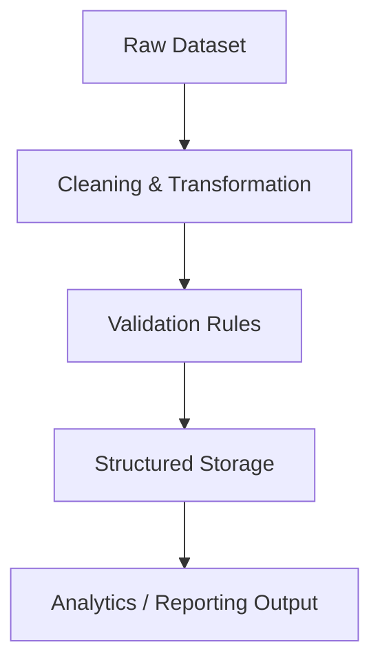

# Duba Venkata Satyanarayana  

### Hybrid Systems Engineer | Backend • Data • Cloud • Performance Engineering  

Java • Python • SQL • AWS • IEEE Published Researcher  

Engineer operating at the intersection of backend architecture, data systems, cloud deployment, and computational optimization.

---

# 📊 GitHub Performance

<p align="center">
  
  
  
</p>

---

# 🧠 Tech Stack

### 💻 Languages


---

### ⚙ Backend & Systems


---

### ☁ Cloud & DevOps


---

# 🏗 System Architecture Thinking

## � Backend Application Architecture

```mermaid
graph TD
    Client[Client (Web/App)] --> REST[REST API Layer]
    REST --> Service[Service Layer (Business Logic)]
    Service --> Validation[Data Validation & Processing]
    Validation --> DB[(Relational Database MySQL/PostgreSQL)]
    DB --> Cloud[Cloud Deployment (AWS EC2 / Elastic Beanstalk)]
```

---

## 🔹 Data Processing Workflow



---

## 🔹 FPGA Computational Design Flow

```mermaid
graph TD
    Algo[Algorithm Selection (Vedic + Karatsuba)] --> RTL[RTL Design (Verilog)]
    RTL --> Sim[Simulation & Functional Validation]
    Sim --> Timing[Performance & Timing Analysis]
    Timing --> Opt[Optimization for Speed & Area]
```

---

# 🚀 Featured Engineering Work

### 🔹 Biz Stratosphere – Modular Analytics Platform

- Designed scalable REST API architecture
- Implemented structured validation pipelines
- Maintained modular backend codebase
- Version-controlled collaborative workflow

---

### 🔹 BudgetWise – SQL-Driven Expense Intelligence

- Designed multiple REST endpoints
- Built relational database schema
- Implemented classification logic
- Ensured data correctness via debugging

---

### 🔹 Stock Portfolio Optimization

- Applied risk-return analysis
- Structured data transformation workflows
- Generated analytical summaries for decision-making

---

### 🔹 IEEE Published 32-bit Hybrid Multiplier

- Improved computational efficiency using hybrid algorithm integration
- Conducted performance and timing analysis
- Published in IEEE ICCCNT 2025  
DOI: 10.1109/ICCCNT.2025.11012447

---

# 🎯 Engineering Philosophy

✔ Correctness First  
✔ Scalable Architecture  
✔ Performance Awareness  
✔ Cross-Domain Systems Thinking  

I build systems — not just features.

---

# 🏆 Credentials

• IEEE ICCCNT 2025 Published Author  
• Oracle Cloud Infrastructure – AI Foundations Associate  
• AWS Solutions Architecture Virtual Experience  
• Student President – ELEKTRA 2K25  

---

# 📬 Connect

📍 Visakhapatnam, India  
📧 <d.v.satyanarayana260@gmail.com>  

> Engineering systems that scale. Optimizing systems that compute.
